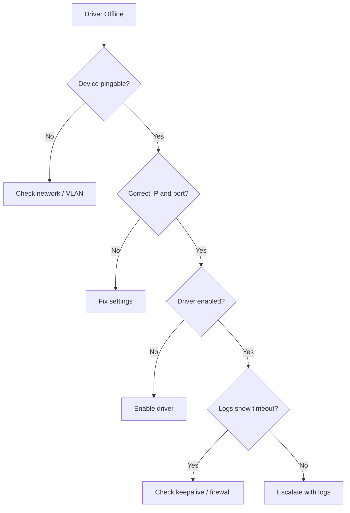

# Troubleshooting Flow

```mermaid
flowchart TD
    A[Driver Offline] --> B{Device pingable?}
    B -- No --> C[Check network / VLAN]
    B -- Yes --> D{Correct IP and port?}
    D -- No --> E[Fix settings]
    D -- Yes --> F{Driver enabled?}
    F -- No --> G[Enable driver]
    F -- Yes --> H{Logs show timeout?}
    H -- Yes --> I[Check keepalive / firewall]
    H -- No --> J[Escalate with logs]
```